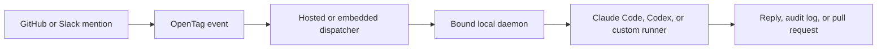

# OpenTag

**Open-source agent mentions for every workspace.**

[](#status)
[](https://www.typescriptlang.org/)
[](https://nodejs.org/)
[](#license)

Claude Tag showed the new interface for team AI: tag an agent where work is already happening, let it use the right tools, and get the result back in the thread.

OpenTag makes that pattern open. Bring `@opentag` to GitHub, Slack, or your own workspace surface; route the request through an auditable dispatcher; and run Claude Code, Codex, Hermes, OpenClaw, or a custom local runner without locking the whole workflow to one vendor.

> OpenTag is not affiliated with Anthropic. It is an open implementation of the agent-mention workflow that Claude Tag made obvious.



## Why OpenTag

Claude Tag is a strong product signal: teams want to tag AI into shared work, not copy context into another chat window. But the first release is Claude-first, Slack-first, and available in beta for Claude Enterprise and Team.

OpenTag is for developers and teams who want the same interaction model with open control:

| Claude Tag pattern | OpenTag approach |
| --- | --- |
| Tag `@Claude` in Slack | Tag `@opentag` from GitHub, Slack, or another adapter |
| Claude executes with configured tools | Any approved executor can run: Claude Code, Codex, Hermes, OpenClaw, or custom |
| Agent identity is provisioned by admins | Repository and channel bindings are explicit, auditable records |
| Work happens inside Anthropic's product boundary | Dispatch can be self-hosted, embedded, or pointed at local runners |
| Results come back to the thread | Results can be comments, progress updates, audit events, branches, or PRs |

The goal is simple: make "tag an agent into work" a protocol, not a closed surface.

## What Works Today

- **GitHub mentions** - `issue_comment.created` and `pull_request_review_comment.created` become normalized OpenTag events.
- **Slack app mentions** - bound Slack channels can route `app_mention` events to the same dispatcher and local daemon path.
- **Auditable dispatch** - every run is stored with event metadata, status transitions, progress, result, and callback delivery events.
- **Explicit runner binding** - a runner only claims runs for repositories it is bound to.
- **Local-first execution** - `opentagd` resolves a configured local checkout before executing anything.
- **Executor adapters** - `echo` is available for smoke tests, and `codex` can run a real Codex CLI task on an isolated branch.
- **Embeddable SDK packages** - use the protocol, client, dispatcher, GitHub, Slack, runner, and store packages independently.

## Quick Start

Requires Node 22.x and pnpm 9.x.

```bash
pnpm install
pnpm test
pnpm build
```

For the full local GitHub-to-runner smoke test, follow [examples/github-to-echo](examples/github-to-echo/README.md). It starts the dispatcher, binds a local runner, creates a sample GitHub-shaped run, executes it with the echo executor, and lets you inspect the audit log.

## Try The Local Echo Loop

Start the dispatcher:

```bash
OPENTAG_DATABASE_PATH=opentag.db pnpm --filter @opentag/dispatcher-app dev
```

Create `opentag.local.json`:

```json
{
  "runnerId": "runner_local",
  "dispatcherUrl": "http://localhost:3030",
  "pollIntervalMs": 5000,
  "heartbeatIntervalMs": 15000,
  "repositories": [
    {
      "provider": "github",
      "owner": "acme",
      "repo": "demo",
      "checkoutPath": "/Users/example/repos/demo",
      "defaultExecutor": "echo",
      "baseBranch": "main",
      "pushRemote": "origin"
    }
  ]
}
```

Register and bind the local runner:

```bash
OPENTAG_CONFIG_PATH=opentag.local.json pnpm --filter @opentag/opentagd dev -- register-runner
OPENTAG_CONFIG_PATH=opentag.local.json pnpm --filter @opentag/opentagd dev -- bind-repos
```

Create a run and execute once:

```bash
curl -X POST http://localhost:3030/v1/runs \
  -H 'content-type: application/json' \
  -d @examples/github-to-echo/run.example.json

OPENTAG_CONFIG_PATH=opentag.local.json pnpm --filter @opentag/opentagd dev -- run-once
```

Inspect the result:

```bash
curl http://localhost:3030/v1/runs/run_demo_1
curl http://localhost:3030/v1/runs/run_demo_1/events
```

## How It Works

1. **Ingress normalizes platform events.** GitHub and Slack adapters translate comments or app mentions into one `OpenTagEvent` schema.
2. **The dispatcher validates scope.** Runs must include repository metadata, and the repository must be explicitly bound to a runner.
3. **The local daemon claims only mapped work.** `opentagd` checks its local repository config before running an executor.
4. **The executor does the work.** The echo executor proves the loop; the Codex executor creates an isolated `opentag/<runId>` branch and runs `codex exec`.
5. **Callbacks and audit events close the loop.** Progress and final results can be posted back to GitHub or Slack, and every step stays queryable through the dispatcher.

## Packages

| Package | Purpose |
| --- | --- |
| `@opentag/core` | Zod schemas, TypeScript types, mention parsing, and JSON Schema exports |
| `@opentag/client` | HTTP client for ingress apps, local runners, and admin setup |
| `@opentag/dispatcher` | Embeddable Hono dispatcher and callback sinks |
| `@opentag/github` | GitHub event normalization, comment rendering, and PR helpers |
| `@opentag/slack` | Slack event normalization, thread keys, and callback helpers |
| `@opentag/store` | SQLite/Drizzle persistence and lease primitives |
| `@opentag/runner` | Executor contracts plus echo and Codex executor adapters |

Runnable apps:

| App | Purpose |
| --- | --- |
| `apps/dispatcher` | Hosted dispatcher process |
| `apps/opentagd` | Local daemon that claims and executes runs |
| `apps/github-probot` | GitHub App ingress |
| `apps/slack-events` | Slack Events API ingress |

## SDK Usage

Normalize a GitHub comment and enqueue it:

```ts
import { createOpenTagClient } from "@opentag/client";
import { normalizeGitHubIssueComment } from "@opentag/github";

const event = normalizeGitHubIssueComment({
  id: String(payload.comment.id),
  commentBody: payload.comment.body,
  commentUrl: payload.comment.html_url,
  apiCommentsUrl: payload.issue.comments_url,
  issueUrl: payload.issue.html_url,
  issueNumber: payload.issue.number,
  owner: payload.repository.owner.login,
  repo: payload.repository.name,
  actorId: payload.sender.id,
  actorLogin: payload.sender.login,
  private: payload.repository.private,
  receivedAt: new Date().toISOString()
});

if (event) {
  const client = createOpenTagClient({
    dispatcherUrl: process.env.OPENTAG_DISPATCHER_URL!,
    pairingToken: process.env.OPENTAG_DISPATCHER_TOKEN
  });

  await client.createRun({
    runId: `run_${Date.now()}`,
    event
  });
}
```

Embed the dispatcher in another Hono-compatible service:

```ts
import { createDispatcherApp, createGitHubCallbackSink } from "@opentag/dispatcher";

export const dispatcher = createDispatcherApp({
  databasePath: "opentag.db",
  pairingToken: process.env.OPENTAG_PAIRING_TOKEN,
  callbackSink: createGitHubCallbackSink({
    token: process.env.OPENTAG_GITHUB_TOKEN
  })
});
```

## Executor Model

OpenTag treats executors as adapters, not as the center of the system.

An executor receives:

- `runId`
- `workspacePath`
- normalized command text
- context pointers from the source workspace

It returns:

- conclusion
- human-readable summary
- changed files
- verification results
- optional artifacts such as a branch or pull request

The built-in Codex executor refuses dirty workspaces, creates an isolated branch, runs `codex exec`, filters internal artifacts, and reports changed files. Third-party runners can implement the same `ExecutorAdapter` contract from `@opentag/runner`.

## Dispatcher Callback Delivery

Set `OPENTAG_GITHUB_TOKEN` on the dispatcher to post acknowledgement, progress, and final callback messages to GitHub comments.

When dispatcher callbacks are enabled, set `OPENTAG_DISPATCHER_OWNS_CALLBACKS=true` on the Probot app to avoid duplicate acknowledgement comments.

Set `OPENTAG_SLACK_BOT_TOKEN` on the dispatcher to post acknowledgement, progress, and final callback messages to Slack threads through `chat.postMessage`.

Set `OPENTAG_PAIRING_TOKEN` on the dispatcher to require a shared Bearer token for `/v1/*` endpoints. Use the same value as `pairingToken` in `opentagd` config, and set `OPENTAG_DISPATCHER_TOKEN` on ingress apps that create runs through the dispatcher.

## Examples

- [GitHub to echo](examples/github-to-echo/README.md) - manual end-to-end GitHub-shaped smoke test.
- [Embedded dispatcher](examples/embedded-dispatcher/README.md) - host the dispatcher inside another Node service.
- [Custom runner](examples/custom-runner/README.md) - build a third-party runner with `@opentag/client` and `@opentag/runner`.

## Status

OpenTag is a young v0 project. The current codebase proves the core loop:

- GitHub and Slack ingress
- normalized protocol schemas
- dispatcher persistence and leases
- local daemon polling and heartbeats
- echo and Codex executors
- GitHub and Slack callbacks
- package-level SDK usage

Next areas of work:

- richer hosted setup flow
- stronger callback delivery observability
- more executor adapters
- more workspace adapters
- production hardening for multi-tenant dispatcher deployments

## Design

The architecture and product direction are documented in [docs/design.md](docs/design.md). Versioning and publishing rules live in [docs/versioning.md](docs/versioning.md).

## License

Public OpenTag packages are licensed under Apache-2.0. Runnable apps are private workspace packages for local development and deployment composition.
