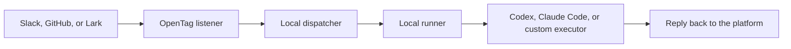

<p align="center">
  <picture>
    <source media="(prefers-color-scheme: dark)" srcset="./assets/readme-logo-dark.png">
    <source media="(prefers-color-scheme: light)" srcset="./assets/readme-logo-light.png">
    
  </picture>
</p>

<p align="center">
  <b>English</b> ·
  <a href="./README.zh-CN.md">简体中文</a>
</p>

# OpenTag

**Connect Slack, GitHub, or Lark to a local coding agent.**

[](https://www.npmjs.com/package/@opentag/cli)
[](https://nodejs.org/)
[](#license)

OpenTag lets your team mention a coding agent from the collaboration platforms they already use. It listens to Slack, GitHub, or Lark / Feishu, runs Codex or Claude Code on your computer, and sends the result back to the same place.


## Quick Start

Requires Node.js 20 or newer.

```bash
npm install -g @opentag/cli
opentag setup
opentag start
```

No global install:

```bash
npx @opentag/cli setup
npx @opentag/cli start
```

`opentag setup` asks four practical questions:

1. Where should OpenTag listen?
2. Which coding agent should OpenTag use?
3. Which local project should OpenTag work on?
4. Which platform credentials should OpenTag save?

After setup, keep `opentag start` running and mention OpenTag from the connected platform:

```text
@opentag investigate this
```

OpenTag runs the selected coding agent locally and replies back through that platform.

## Ask Your Agent

If you use Codex or Claude Code and do not want to set this up by hand, start a new agent session and paste:

```text
Help me set up OpenTag from https://github.com/amplifthq/opentag.

Use the published OpenTag CLI. Please:
1. Check that Node.js 20 or newer is available.
2. Install or run @opentag/cli.
3. Run opentag setup and help me choose Slack, GitHub, or Lark / Feishu, a coding agent, and a local project.
4. When platform credentials are needed, open the matching setup guide in the repository and walk me through it.
5. Start OpenTag with opentag start and verify the setup with opentag status or opentag doctor.

Do not invent credentials or secrets. Ask me before entering any token, app ID, channel ID, repository, or project path.
```

## Platform Guides

Use the guide for the platform you choose in `opentag setup`.

| Platform | Best first path | Guide |
| --- | --- | --- |
| Slack | Use Socket Mode for local development | [Slack setup](docs/platforms/slack.en.md) |
| GitHub | Use a repository webhook and GitHub token | [GitHub setup](docs/platforms/github.en.md) |
| Lark / Feishu | Scan the Personal Agent QR code from setup | [Lark / Feishu setup](docs/platforms/lark.en.md) |

OpenTag also has an experimental Telegram adapter, but CLI setup is not ready for it yet.

## What Runs Locally

`opentag start` runs in the foreground on your computer. It starts:

- a local dispatcher
- a local runner for the project you selected
- the selected platform listener

Stop it with:

```text
Ctrl-C
```

OpenTag stores local config here:

```text
~/.config/opentag/config.json
```

Runtime state and isolated worktrees default to:

```text
~/.local/state/opentag
```

## Privacy

OpenTag's CLI path is local-first.

- There is no OpenTag cloud service in the local CLI flow.
- Platform credentials are stored on your computer with private file permissions.
- Codex and Claude Code run against your local checkout.
- Platform APIs receive only the messages needed to acknowledge, reply, and apply actions you approve.

## Supported Coding Agents

| Coding agent | Status | Notes |
| --- | --- | --- |
| Codex | Ready | Uses the local `codex` command |
| Claude Code | Ready | Uses the local `claude` command |
| Echo | Dev/test only | Does not run a real coding agent |

## Commands

| Command | What it does |
| --- | --- |
| `opentag setup` | Create or update local OpenTag config |
| `opentag start` | Start the local OpenTag stack |
| `opentag status` | Show local config and runtime status |
| `opentag doctor` | Run deeper setup checks |
| `opentag platforms` | List platform setup support |
| `opentag executors` | List available coding agents |
| `opentag config path` | Print the local config path |
| `opentag config show` | Print redacted local config |

## Uninstall

Remove the global CLI package:

```bash
npm uninstall -g @opentag/cli
```

Remove local OpenTag config and state:

```bash
rm -rf ~/.config/opentag ~/.local/state/opentag
```

## How It Works



The important boundary: platforms receive messages, OpenTag coordinates the run, and the coding agent executes on your machine.

## Developer Docs

- [Platform setup guides](docs/platforms/README.md)
- [Configuration](docs/configuration.md)
- [Adapter authoring](docs/adapter-authoring.md)
- [Real integration smoke test](docs/real-integration-smoke-test.md)
- [Agent Work Protocol](docs/agent-work-protocol.md)
- [Local npm release guide](docs/npm-release.md)

## Development

From source:

```bash
corepack pnpm install
corepack pnpm test
corepack pnpm typecheck
corepack pnpm build
```

Install the local development command:

```bash
corepack pnpm opentag-dev
opentag-dev setup
```

## Packages

The npm package family is published under the `@opentag` scope.

| Package | Purpose |
| --- | --- |
| [`@opentag/cli`](https://www.npmjs.com/package/@opentag/cli) | Setup and local runtime command line interface |
| [`@opentag/local-runtime`](https://www.npmjs.com/package/@opentag/local-runtime) | In-process local dispatcher, runner, and platform runtime |
| [`@opentag/core`](https://www.npmjs.com/package/@opentag/core) | Protocol schemas, types, mention parsing, and JSON Schema exports |
| [`@opentag/client`](https://www.npmjs.com/package/@opentag/client) | Dispatcher HTTP client |
| [`@opentag/slack`](https://www.npmjs.com/package/@opentag/slack) | Slack Socket Mode, Events API handling, and thread replies |
| [`@opentag/github`](https://www.npmjs.com/package/@opentag/github) | GitHub webhook handling, comments, PR helpers, and action application |
| [`@opentag/lark`](https://www.npmjs.com/package/@opentag/lark) | Lark / Feishu ingress, Personal Agent registration, and replies |
| [`@opentag/runner`](https://www.npmjs.com/package/@opentag/runner) | Executor contracts plus Echo, Claude Code, and Codex adapters |
| [`@opentag/store`](https://www.npmjs.com/package/@opentag/store) | SQLite persistence |
| [`@opentag/dispatcher`](https://www.npmjs.com/package/@opentag/dispatcher) | Embeddable dispatcher and callback sinks |

## License

OpenTag is licensed under the MIT License. See [LICENSE](LICENSE).
