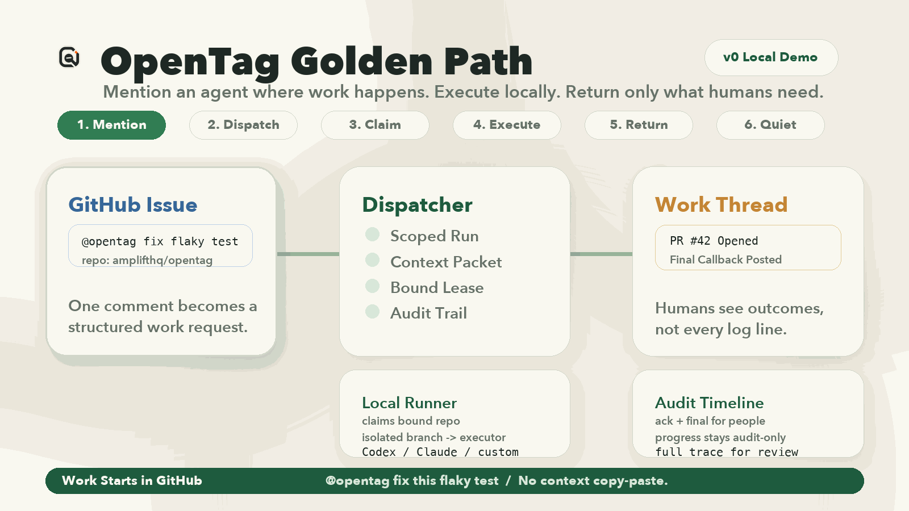
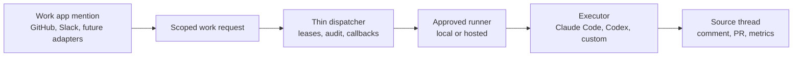

<p align="center">
  <picture>
    <source media="(prefers-color-scheme: dark)" srcset="./assets/readme-logo-dark.png">
    <source media="(prefers-color-scheme: light)" srcset="./assets/readme-logo-light.png">
    
  </picture>
</p>

# OpenTag

**Open-source agent mentions for the apps where work happens.**

[](#status)
[](https://github.com/amplifthq/opentag/releases)
[](https://www.npmjs.com/package/@opentag/core)
[](https://www.typescriptlang.org/)
[](https://nodejs.org/)
[](#license)

Claude Tag made the interface obvious: mention an agent where work already happens and get the result back in the thread. OpenTag is the open version: a work thread mention becomes a scoped run, an approved local or hosted runner executes Claude Code, Codex, or your own agent, and the result returns to the source thread with an audit trail.

OpenTag is not another AI workspace. It brings agents to the work item thread you already use.

> OpenTag is not affiliated with Anthropic. It is an open implementation of the agent-mention workflow that Claude Tag made obvious.



Real smoke tests have validated:

- GitHub issue -> OpenTag -> local Claude Code -> commit branch -> pull request -> GitHub callback
- Slack thread -> OpenTag -> local Claude Code -> Slack final callback with audit-only progress

## Quick Start

Requires Node 22.x and pnpm 9.x.

```bash
pnpm install
pnpm test
pnpm smoke:protocol
pnpm smoke:slack-protocol
pnpm build
```

For local app and runner configuration, copy `.env.example` to `.env` and replace the placeholder values.

The smoke tests start an in-process dispatcher with a temporary SQLite database and exercise the protocol chain through the client SDK. For a full local runner loop, start with [examples/github-to-echo](examples/github-to-echo/README.md). For the product demo path, use [examples/github-to-pr](examples/github-to-pr/README.md).

## Why OpenTag

- **Bring agents to work threads** - mention an approved agent from GitHub, Slack, or future work app adapters instead of copying context into a separate AI chat workspace.
- **Control where execution happens** - keep coding work local with `opentagd`, or use hosted/custom runners that implement the same claim and callback contracts.
- **Use any approved executor** - built-in adapters cover `echo`, `claude-code`, and `codex`; custom runners can implement the same contract.
- **Return outcomes, not noise** - human threads get useful acknowledgements and final results while detailed progress stays in audit events and metrics.
- **Govern external writes** - repository bindings, permission scopes, context packets, and audit trails make agent authority explicit.

## How It Works



1. Ingress adapters normalize platform comments or app mentions into one work request.
2. The dispatcher validates scope, persists the run, manages leases, and records audit events.
3. A local or hosted runner claims only work it is explicitly bound to handle.
4. The executor does the work in the mapped checkout and returns structured results.
5. Callback adapters update the source thread without flooding it.

## Why Teams Can Trust the Loop

- **Bounded claims** - runners claim only repositories or channels explicitly bound to them.
- **Local-first execution** - repo access, build tools, credentials, and private context can stay in the user's own checkout.
- **Branch isolation** - coding executors work on an `opentag/<runId>` branch or worktree instead of writing directly to the target branch.
- **Dirty-worktree protection** - Codex and Claude Code executors refuse to run against unsafe local checkout state.
- **Explicit external writes** - pull requests, status changes, labels, and other system mutations require explicit capability or configuration.
- **Quiet callbacks** - source threads receive acknowledgements, blockers, and final results; routine progress stays audit-only by default.
- **Auditable context** - the Work Thread, Context Packet, and Audit Trail preserve what was asked, what was included, who ran it, and what happened next.

## Works Today / Experimental / Future

| Area | Status | Notes |
| --- | --- | --- |
| GitHub | Works today | Issue comments, PR review comments, callbacks, and pull request creation from local daemon runs when configured |
| Slack | Works today | App mentions, channel-to-repo bindings, thread callbacks, and audit-only routine progress |
| Local daemon | Works today | Polling, heartbeats, lease-based claiming, repository bindings, and dirty-worktree protection |
| Executors | Works today | `echo`, Claude Code (`claude --print`), Codex (`codex exec`), and custom executor contracts |
| Protocol runtime | Works today | Work Threads, Context Packets, Audit Trails, run admission, quiet callbacks, and metrics |
| Telegram and Lark | Experimental adapters | Normalizers, ingress apps, and callback helpers are present; treat them as adapter-expansion surfaces rather than the main v0 golden path |
| Hosted multi-tenant control plane | Future hardening | The dispatcher is intentionally thin today; production multi-tenant hosting needs more operational hardening |

For teams building governed workflows, the deeper protocol vocabulary lives in [Agent Work Protocol](docs/agent-work-protocol.md): capability contracts, policy resolution, suggested changes, approvals, apply plans, and lineage.

## Packages

Current public release: `v0.1.0`. The npm package family is published under the `@opentag` scope.

```bash
pnpm add @opentag/core @opentag/client @opentag/dispatcher @opentag/github @opentag/slack @opentag/runner @opentag/store
```

| Package | Purpose |
| --- | --- |
| [`@opentag/core`](https://www.npmjs.com/package/@opentag/core) | Protocol schemas, types, mention parsing, and JSON Schema exports |
| [`@opentag/client`](https://www.npmjs.com/package/@opentag/client) | Dispatcher HTTP client for ingress apps, runners, admin setup, and tests |
| [`@opentag/dispatcher`](https://www.npmjs.com/package/@opentag/dispatcher) | Embeddable Hono dispatcher and callback sinks |
| [`@opentag/github`](https://www.npmjs.com/package/@opentag/github) | GitHub event normalization, comment rendering, PR helpers, and mutation helpers |
| [`@opentag/slack`](https://www.npmjs.com/package/@opentag/slack) | Slack event normalization, thread keys, and callback helpers |
| [`@opentag/store`](https://www.npmjs.com/package/@opentag/store) | SQLite/Drizzle persistence for runs, audit events, leases, policy, and metrics |
| [`@opentag/runner`](https://www.npmjs.com/package/@opentag/runner) | Executor contracts plus echo, Claude Code, and Codex adapters |

Runnable apps live in `apps/dispatcher`, `apps/opentagd`, `apps/github-probot`, and `apps/slack-events`.

## Examples and Guides

- [GitHub to echo](examples/github-to-echo/README.md) - manual end-to-end GitHub-shaped local runner loop.
- [GitHub to PR](examples/github-to-pr/README.md) - product demo path from GitHub issue mention to local execution, pull request, callback, and audit evidence.
- [Embedded dispatcher](examples/embedded-dispatcher/README.md) - host OpenTag inside another Node service.
- [Custom runner](examples/custom-runner/README.md) - build a third-party runner with `@opentag/client` and `@opentag/runner`.
- [Configuration](docs/configuration.md) - map dispatcher, daemon, ingress, callback, and runner settings.
- [Adapter authoring](docs/adapter-authoring.md) - add new work app adapters without changing the execution model.
- [Real integration smoke test](docs/real-integration-smoke-test.md) - real GitHub and Slack setup, trigger, and debugging order.
- [Design](docs/design.md) - product direction, system shape, package boundaries, and v0 scope.
- [Agent Work Protocol](docs/agent-work-protocol.md) - context packets, quiet callbacks, approvals, lineage, and governance semantics.
- [Versioning](docs/versioning.md) - release and package versioning rules.

## Agent Skill

Install the OpenTag skill for any supported agent:

```bash
npx skills add https://github.com/amplifthq/opentag --skill opentag --agent '*'
```

## Status

OpenTag is a young v0 project for local evaluation, integration experiments, and early SDK feedback. The current codebase proves the first GitHub and Slack adapter loops: ingress -> dispatcher -> runner -> callback, including package-level SDK usage and real local smoke tests.

Next areas of work:

- richer hosted setup flow
- GitHub Project field mapping for status and priority
- more workspace adapters and adapter compilers
- adapter-specific context packet redaction and classification hooks
- production hardening for multi-tenant dispatcher deployments

## License

OpenTag is licensed under the MIT License. See [LICENSE](LICENSE).
