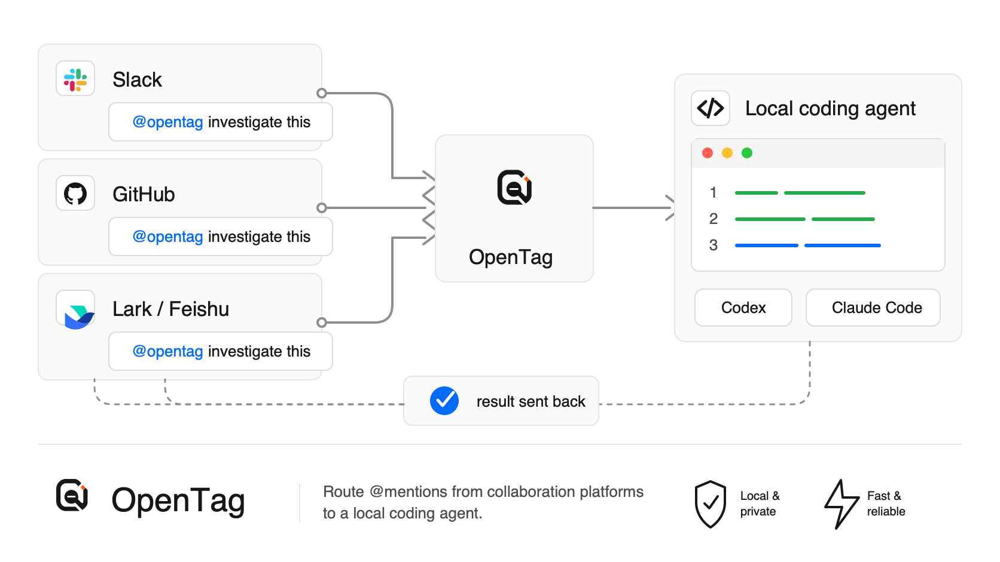
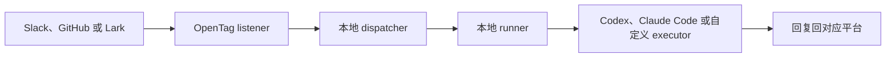

<p align="center">
  <picture>
    <source media="(prefers-color-scheme: dark)" srcset="./assets/readme-logo-dark.png">
    <source media="(prefers-color-scheme: light)" srcset="./assets/readme-logo-light.png">
    
  </picture>
</p>

<p align="center">
  <a href="./README.md">English</a> ·
  <b>简体中文</b>
</p>

# OpenTag

**把 Slack、GitHub 或 Lark 连接到你本地的 coding agent。**

[](https://www.npmjs.com/package/@opentag/cli)
[](https://nodejs.org/)
[](#许可证)

OpenTag 让团队可以在已经使用的协作软件里提及一个 coding agent。它可以监听 Slack、GitHub 或 Lark / 飞书，在你的电脑上运行 Codex 或 Claude Code，然后把结果回复回原来的地方。



## 快速开始

需要 Node.js 20 或更新版本。

```bash
npm install -g @opentag/cli
opentag setup
opentag start
```

不想全局安装：

```bash
npx @opentag/cli setup
npx @opentag/cli start
```

`opentag setup` 会问你四个实际问题：

1. OpenTag 要监听哪里？
2. OpenTag 要使用哪个 coding agent？
3. OpenTag 可以操作哪个本地项目？
4. OpenTag 要保存哪些平台凭据？

setup 完成后，保持 `opentag start` 运行，然后在已连接的平台里提及 OpenTag：

```text
@opentag investigate this
```

OpenTag 会在本地运行你选择的 coding agent，并通过对应的平台回复结果。

## 让 Agent 帮你

如果你已经在用 Codex 或 Claude Code，但不熟悉 CLI，可以新开一个 agent session，直接粘贴：

```text
Help me set up OpenTag from https://github.com/amplifthq/opentag.

Use the published OpenTag CLI. Please:
1. Check that Node.js 20 or newer is available.
2. Install or run @opentag/cli.
3. Run opentag setup and help me choose Slack, GitHub, or Lark / Feishu, a coding agent, and a local project.
4. When platform credentials are needed, open the matching setup guide in the repository and walk me through it.
5. Start OpenTag with opentag start and verify the setup with opentag status or opentag doctor.

Do not invent credentials or secrets. Ask me before entering any token, app ID, channel ID, repository, or project path.
```

## 平台教程

在 `opentag setup` 里选择哪个平台，就看对应教程。

| 平台 | 推荐首选路径 | 教程 |
| --- | --- | --- |
| Slack | 本地开发优先使用 Socket Mode | [Slack 配置](docs/platforms/slack.zh-CN.md) |
| GitHub | 使用 repository webhook 和 GitHub token | [GitHub 配置](docs/platforms/github.zh-CN.md) |
| Lark / 飞书 | 在 setup 里扫码创建 Personal Agent | [Lark / 飞书配置](docs/platforms/lark.zh-CN.md) |

OpenTag 也有实验性的 Telegram adapter，但 CLI setup 还没有接入。

## 本地会运行什么

`opentag start` 是在你电脑上运行的前台进程。它会启动：

- 本地 dispatcher
- 绑定到你所选项目的本地 runner
- 已选择的平台监听器

停止它：

```text
Ctrl-C
```

OpenTag 本地配置默认写到：

```text
~/.config/opentag/config.json
```

Runtime state 和隔离 worktree 默认写到：

```text
~/.local/state/opentag
```

## 隐私和本地优先

OpenTag 的 CLI 路径是本地优先的。

- 本地 CLI 流程里没有 OpenTag cloud service。
- 平台凭据保存在你的电脑上，并使用私有文件权限。
- Codex 和 Claude Code 会在你的本地 checkout 上运行。
- 平台 API 只会收到 OpenTag 用来确认、回复和执行已审批 action 所需的消息。

## 支持的 Coding Agent

| Coding agent | 状态 | 说明 |
| --- | --- | --- |
| Codex | 已支持 | 使用本机的 `codex` 命令 |
| Claude Code | 已支持 | 使用本机的 `claude` 命令 |
| Echo | 仅开发/测试 | 不运行真实 coding agent |

## 常用命令

| 命令 | 用途 |
| --- | --- |
| `opentag setup` | 创建或更新本地 OpenTag 配置 |
| `opentag start` | 启动本地 OpenTag stack |
| `opentag status` | 查看本地配置和运行状态 |
| `opentag doctor` | 做更深入的 setup 检查 |
| `opentag platforms` | 查看平台 setup 支持状态 |
| `opentag executors` | 查看可用 coding agent |
| `opentag config path` | 输出本地配置文件路径 |
| `opentag config show` | 输出脱敏后的本地配置 |

## 卸载

移除全局 CLI 包：

```bash
npm uninstall -g @opentag/cli
```

删除本地 OpenTag 配置和状态：

```bash
rm -rf ~/.config/opentag ~/.local/state/opentag
```

## 工作方式



最重要的边界是：平台负责接收和回复消息，OpenTag 负责任务调度，coding agent 在你的电脑上执行。

## 开发者文档

- [平台配置教程](docs/platforms/README.md)
- [配置说明](docs/configuration.md)
- [适配器开发](docs/adapter-authoring.md)
- [真实集成 smoke test](docs/real-integration-smoke-test.md)
- [Agent Work Protocol](docs/agent-work-protocol.md)
- [本地 npm 发布指南](docs/npm-release.md)

## 本地开发

从源码运行：

```bash
corepack pnpm install
corepack pnpm test
corepack pnpm typecheck
corepack pnpm build
```

安装本地开发命令：

```bash
corepack pnpm opentag-dev
opentag-dev setup
```

## 软件包

OpenTag 的 npm 包发布在 `@opentag` scope 下。

| 包 | 用途 |
| --- | --- |
| [`@opentag/cli`](https://www.npmjs.com/package/@opentag/cli) | setup 和本地 runtime CLI |
| [`@opentag/local-runtime`](https://www.npmjs.com/package/@opentag/local-runtime) | 进程内本地 dispatcher、runner 和平台 runtime |
| [`@opentag/core`](https://www.npmjs.com/package/@opentag/core) | 协议 schema、类型、mention 解析和 JSON Schema 导出 |
| [`@opentag/client`](https://www.npmjs.com/package/@opentag/client) | Dispatcher HTTP client |
| [`@opentag/slack`](https://www.npmjs.com/package/@opentag/slack) | Slack Socket Mode、Events API 和回复 |
| [`@opentag/github`](https://www.npmjs.com/package/@opentag/github) | GitHub webhook、评论、PR helper 和 action apply |
| [`@opentag/lark`](https://www.npmjs.com/package/@opentag/lark) | Lark / 飞书入口、Personal Agent 注册和回复 |
| [`@opentag/runner`](https://www.npmjs.com/package/@opentag/runner) | Executor 契约，以及 Echo、Claude Code、Codex 适配器 |
| [`@opentag/store`](https://www.npmjs.com/package/@opentag/store) | SQLite 持久化 |
| [`@opentag/dispatcher`](https://www.npmjs.com/package/@opentag/dispatcher) | 可嵌入 dispatcher 和 callback sink |

## 许可证

OpenTag 基于 MIT License 开源。详见 [LICENSE](LICENSE)。
